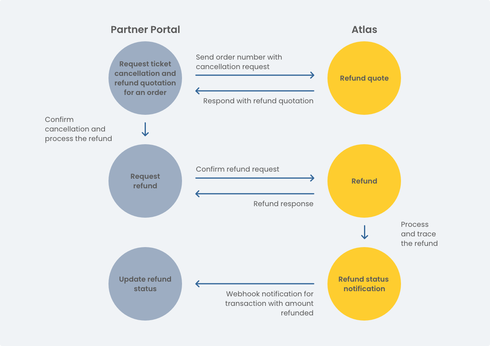

# Refund/Cancel an Order

To process a cancellation request, you need to provide the `OrderNo` of the order you'd like to cancel. Please note, not all airlines will offer cancellation services.



## 1. Refund Quotation

Send the `orderNo`, along with the passengers' names and segment information such as `depAirport`, `arrAirport`, `depDate` and `flightNo`. Atlas charges a transaction fee on top of the amount deducted by airlines for every refund request.

EndPoint ：  [https://sandbox.atriptech.com/refundQuotation.do](https://sandbox.atriptech.com/refundQuotation.do) 


Method : Post

Header:

```
x-atlas-client-id ： <Your clientid>
x-atlas-client-secret : <Your client secretid>
Content-Type: application/json
Accept-Encoding: gzip
```



```json
{
    "cid":"XXXXXXXX",
    "orderNo":"XPFIW20220209163159425",
    "refundRequestList":[
        {
            "lastName":"TEST",
            "firstName":"ONE",
            "segments":[
                {
                    "depDate":"20220302",
                    "flightNo":"5J562",
                    "depAirport":"CEB",
                    "arrAirport":"MNL"
                }
            ]
        },
        {
            "lastName":"TEST",
            "firstName":"THREE",
            "segments":[
                {
                    "depDate":"20220302",
                    "flightNo":"5J562",
                    "depAirport":"CEB",
                    "arrAirport":"MNL"
                }
            ]
        }
    ]
}
```



```
{
    "status": 0,
    "msg": "success",
    "isRefundable": true,
    "currency": "USD",
    "originalTotalFareAmount": 37.14,
    "originalTotalAncillaryAmount": 8.12,
    "originalTotalAmount": 45.26,
    "airlinePenaltyAmountForFare": 0.00,
    "airlinePenaltyAmountForAncillaries": 0.00,
    "airlinePenaltyAmount": 0.00,
    "estimatedRefundAmount": 45.26,
    "transactionFee": 2.00,
    "refundOfferId": "7961ab5b202642628e9595498ffea083"   
}
```



## 2. Refund

When your customer confirms the refund quote, send the request schema with `refundOfferID` to the refund endpoint to confirm the refund request.

EndPoint ：  [https://sandbox.atriptech.com/refund.do](https://sandbox.atriptech.com/refund.do) 

Method : Post

Header:

```
x-atlas-client-id ： <Your clientid>
x-atlas-client-secret : <Your client secretid>
Content-Type: application/json
Accept-Encoding: gzip
```



```json
{
    "cid": "XXXXXXXX",
    "orderNo": "XPFIW20220209163159425",
    "refundOfferId":"xxxxxxxxxxxxxxxxxxxxx"
}
```



```
{
    "status": 0,
    "msg": "success"
    "refundStatus": 0,
    "currency": "USD",
    "originalTotalFareAmount": 37.14,
    "originalTotalAncillaryAmount": 8.12,
    "originalTotalAmount": 45.26,
    "airlinePenaltyAmountForFare": 0.00,
    "airlinePenaltyAmountForAncillaries": 0.00,
    "airlinePenaltyAmount": 0.00,
    "estimatedRefundAmount": 45.26,
    "transactionFee": 2.00,
    "refundOfferId": "7961ab5b202642628e9595498ffea083",
    "isRefundable": true   
}
```






