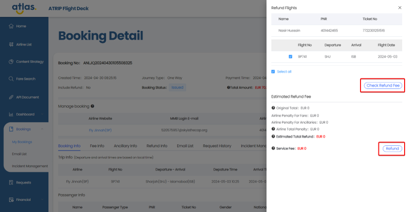
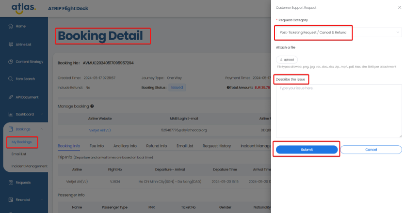
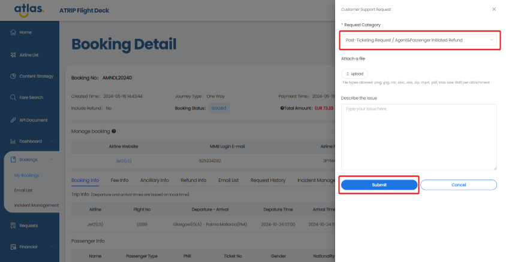
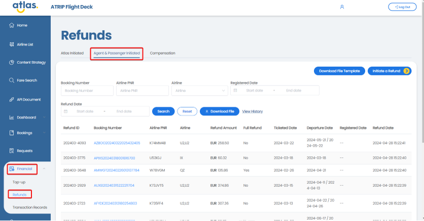
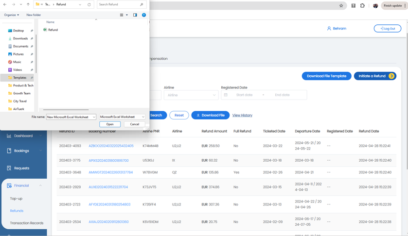
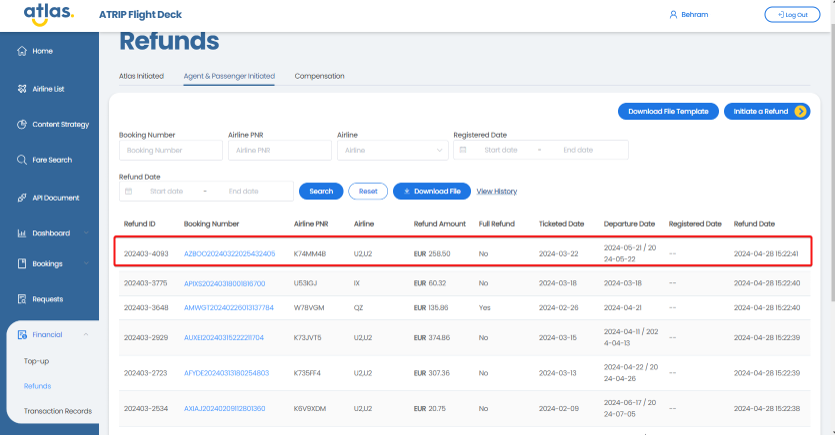
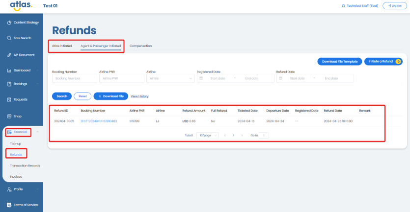
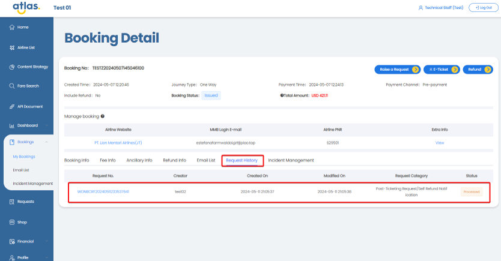

# Atlas API Post-ticketing

## **Do we get notified when there is a change in flight schedule for our customers?**

Sometimes airlines can make changes to their flight schedule. These changes range from minor changes in flight schedules to major ones such as cancellation or rerouting.
In this case, the airline will send the message to the contact email or mobile number of this booking.

## **How is the post-ticketing process being handled?**

Atlas API supports the post-ticketing process. The API allows for post-ticketing functions such as purchasing ancillary services, cancellation requests and processing refunds. Please refer to the API Reference section for further information. You can also reach out to our API support team or the Customer Service Centre to investigate any post-ticketing queries.
Post-ticketing processes can also be handled via the ATRIP portal in the following manner:

Refunds and cancellations: We have a refunds feature in ATRIP which should be used for sending refund requests to Atlas. For an LCC cancellations and refunds are one and the same. We will cancel the booking and refund the amount to your account with Atlas.

Changes: Create a service request. Our ops team will process this for you.

Ancillary Baggage: We have an ancillary baggage feature in ATRIP which should be used for adding baggage to an existing booking.

## **Do you provide 24/7 support for urgent post-sales issues?**

For urgent matter (changes/cancellations/adding of baggage, etc) within 24 hours of flight departure, we recommend that the customer connects directly with the airline using the "Manage My Booking" feature on the airline website.

## **Please explaining the refund and cancellation policies?**

The latest refund and cancellation policies are available on the airline website. These should be referred to.

## **How long does it take to process refunds once a request is submitted?**

We will submit the refund request to the airline within 4 hrs of receipt. In some specific cases, the airline may need many days to verify and respond with a confirmation. Regarding the refund amount being credited into your account, it depends from airline to airline. Once the refund is received from the airline, our internal systems will reconcile the same and then credit the amount into your ATRIP balance. Once processed, the refund will also show in the reconciliation statement received by you.

## **What is the process for making changes to a booking after the sale (e.g., name corrections, flight changes)?**

Please create a Service Request (SR) using ATRIP.

## **How do you handle involuntary changes, such as schedule changes by the airline? Is it FOC?**

You can use the refund feature available in ATRIP. It is FOC.

## **In case of a service failure/ Booking Failure (e.g., delayed refunds or incorrect rebooking or booking not confirmed), what compensation , waivers or remedies do you provide?**

If there is an incorrect booking or ticketing, Atlas will compensate for the new ticket. With regards to refunds, Atlas does not have any control and will not compensate. The timelines of the refunds depends on when the airline provides the amount back to Atlas.

## **What training resources or support do you provide for our customer service or operations teams on post-sale procedures?**

We will have a "Go-Live" call after the UAT certification has been completed. We will walk-through the ATRIP portal and you may ask any questions during or after the call.

## **Do you offer or have materials and guidelines for the correct system utilization ?**
The ATRIP portal is very user friendly. We will provide you with a user guide for the post-ticketing services. You may ask any further questions, if required.

## **Is there a refund claim process for Atlas customers?**

The refund claim process differs as per the mode of payment. Please refer to the process as per the payment mode:

Mode of Payment: **Deposit**

1. When the refund has been initiated by customers via Atlas, Atlas will process the refund and keep a track of the refund status. Customers can request Atlas for the refund status.
   
2. When customers or the passenger submits the refund to the airline directly, customers can use the "Agent and Passenger Initiated Refund" feature in ATRIP to send Atlas a notification. Atlas will refund the ticket when Atlas receives the funds from the airline. Customers can also request Atlas for the refund status.

Mode of Payment: **VCC**

When the refund has been initiated by customers via Atlas OR when customers or the passenger submits the refund to the airline directly, the funds will be directly credited into customers VCC account by the airline. The card statement will show the credit into the account. Please note that for VCC mode of payment, the "Agent and Passenger Initiated Refund" feature should not be used.

## **What is the REFUND process to be followed with Atlas?**

A comprehensive process for refund is documented below for our customers.

### Method of Initiating Refund with Atlas

#### 1) Atlas Initiated Refund
   
a) Refund button.

b) Service request (Cancel & Refund)

#### 2) Agency & Passenger Initiated Refund

a) Service request (Agency & Passenger Initiated Refund)
      
b)	Batch update.

#### Atlas Initiated Refund

##### Refund Button

Refund for all airlines can be submitted to Atlas.

In the “Booking Detail” screen:

1)	Click on the “Refund” button. A slide-out window is displayed.
   
2)	Check the refund fee.
   
3)	Accept the calculation and click the “Refund” button.
   
Our operations team will process the refund.

This is the recommended method of initiating refund with Atlas as the refund quotation will be instant.

 

##### Service Request (Cancel & Refund)

In the “Booking Detail” screen, the customer can click on the “Raise a Request” button. A slide-out window will open. 

The customer can: 

1)	Select the “Post-Ticketing Request  Cancel & Refund” option.
   
2)	Add the information regarding the refund in the “Describe the issue” box.
   
3)	“Submit” the request.
   
Our operations team will process the refund once the quote is accepted by the customer.

A service request can be submitted in 2 ways: 

1)	By clicking on the “Raise a Request” button on the “Booking Detail” screen.
   
2)	By clicking on the “New Request” button on the “My Requests” screen. Please note that the order number would need to be entered if this option is used.

#### Agent & Passenger Initiated Refund

##### Service Request (Agency & Passenger Initiated Refund)

When the customer or the passenger has already submitted the refund to the airline directly, the “Agency & Passenger Initiated Refund” option should be used.

In the “Booking Detail” screen, the customer can click on the “Raise a Request” button. A slide-out window will open. 

The customer can: 

1)	Select the “Post-Ticketing Request  Agent & Passenger Initiated Refund” option.
   
2)	“Submit” the request.
   
The refund request will be added to the “Refund” queue at Atlas’ end and processed by our operations team.

The order number will be added to the refund queue at Atlas’ end.

A service request can be submitted in 2 ways:

1)	By clicking on the “Raise a Request” button on the “Booking Detail” screen.
   
2)	By clicking on the “New Request” button on the “My Requests” screen. Please note that the order number would need to be entered if this option is used.

##### Batch Update 

After initiating the refund on the airline website, the customer will access the “Financial” module and the “Refund” menu. The customer will then click on the “Agent & Passenger Initiated” tab.

The refund template needs to be downloaded via the “Download File Template” button. 

The order numbers need to be added in the template and the same template must be uploaded by clicking on the “Initiate a Refund” button.

Once uploaded, the order number will be displayed in the “Refunds” list.

#### Checking the Refund Status

The refund status can be checked in ATRIP from “Finance  Refunds” section.

#### Checking the Service Requests Created

The service request details will be also displayed in the “Request History” tab in the booking details.

### Follow-up Process for Refunds

The customer should follow-up for refunds after a minimum of 21 days from the refund submission date.

The customers should use the already created service request (if refund initiated via a service request) or create a new service request via the "Post-ticketing Request --> Cancel & Refund" category to inquire for the submitted refunds.
