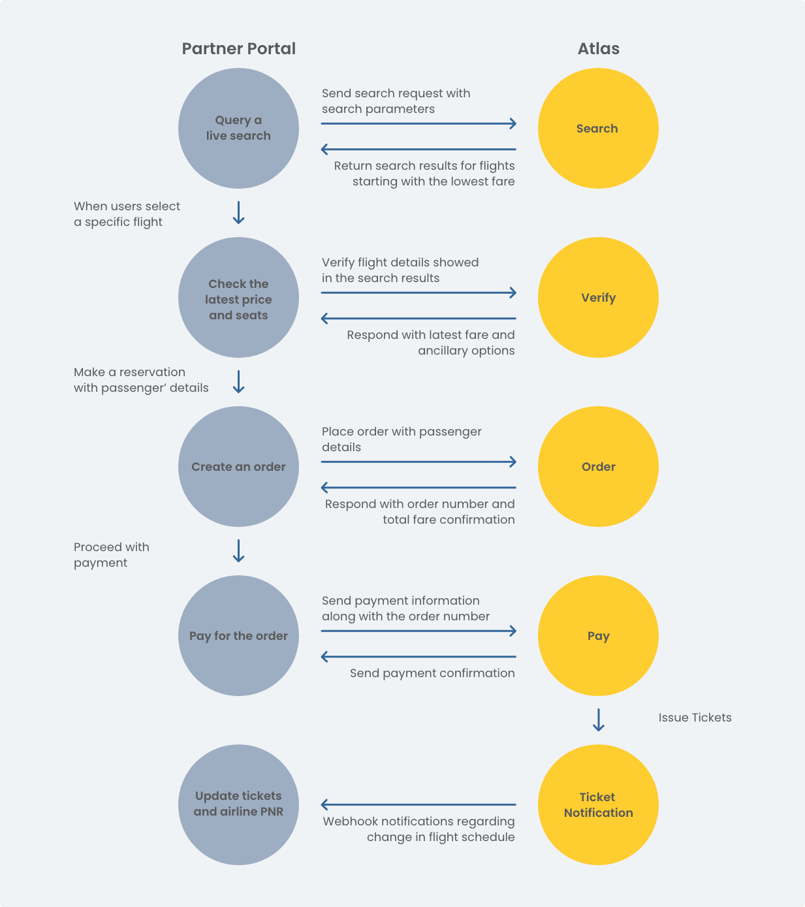




# Quick Start

This guide shows you how Atlas API instantly connects you to over 100 LCCs — opening up new markets for your business.

The integration is a simple four-step process:

Let’s get you started!

## Get Atlas Sandbox credentials

The Sandbox API credentials or the API key will be created and shared by your account manager. The API credentials or key contain two items: **x-atlas-client-id** and **x-atlas-client-secret**.

The API Key is used to authenticate your API requests. Any request that doesn't include an API key will return an error.

Please add them to the header of each post request.


**Tip**: We've put together a Postman Collection that contains all of the requests you'll need to follow along with this guide; please download it 
 [here](../.gitbook/assets/TheAtlas UAT Test Shopping & Ticketing Services Only Postman Collection.zip).



## Issue a Ticket

As a travel seller, your goal is to help your customers find the best flight routes at affordable prices. So, let’s look at how Atlas API can help you achieve this with minimal development to your existing booking and reservation system.

The booking process is relatively simple, as illustrated:

## 1. Search

Create an order request to search for flights.

To build an order, you'll need to provide passenger information and itinerary details. Your customers need to enter information such as the number of passengers, origin, destination and travel dates. The ticket fare for passengers under 12 is different, so you need to mention the number of infants or child passengers below 12. LCCs also have a limitation on baggage; passengers need to buy check-in luggage separately, so we ask for the number of bags and maximum baggage weight. 

Once the request is submitted, we send the search parameters to our robust search cache. The cache will respond with real-time offers in <1 sec for partner airlines operating flights between the source and destination cities on the requested date. Atlas algorithm can process over 5000 queries per second (QPS). Currently, you cannot filter the number of search results by airlines. We are working to add this feature so our partner agencies can limit the search results to include only their preferred airlines.

Here's how the function works:

- [Search](./api-reference/shopping-and-ticketing/search.md)

Please record `routingIdentifier` for each routing offer.

## 2. Verify

The offers returned as a result of the search query will have detailed information about the flight, such as departure and arrival time, the number of layovers, flight number, and fare. Once the user selects a flight of their choice, the fare and flight information are verified.

Obtain the `routingIdentifier` for the selected routing and send it with the verification request.

- [Verify](./api-reference/shopping-and-ticketing/verify.md)

## 3. Order

The user is now one step away from making a booking with you. They need to enter their full name, gender, birth date, nationality, credit card details and billing address. 

Reference the `sessionId` recorded from the verification response and send it along with the order request with passenger details and ancillary selections with `productCode` of each `ancillaryProductElement`.

As soon as they submit their details, they will see the detailed itinerary and ancillary information, PNR number, and information on cancellation, change and refunds.

- [Order](./api-reference/shopping-and-ticketing/order.md)

## 4. Pay

Atlas supports two options for payment:

* Atlas to settle payment with the airline
* You can directly pay the airline 

If you choose the first option, you pay the total ticket amount plus the technical service fee to Atlas, and Atlas will settle the payment with the airlines on your behalf.

If you choose the second option, we will send your credit card information along with the`IssueTicket` request to the airline. In this case, we will deduct the technical service fee from your account with Atlas. Several airlines support the pass-through option, for which we have added the`supportCreditTransPayment`function in the routing element.

Reference the `orderNo` from the order response when sending the payment request.

- [payment](./api-reference/shopping-and-ticketing/payment.md)

## 5. Ticket Notification Webhook

Atlas uses webhooks to automatically notify partner agencies when there is a change in flight schedule for any of their orders. You can then inform your customers of the change.

Please follow the steps [here](./api-reference/notifications-by-webhook/) to register your webhooks and start receiving notifications.

In case of any changes, you will receive `order.ticketed` notification on your server. You can process this information and act on it as needed.

- [ticketing-complete-notification](./api-reference/notifications-by-webhook/ticketing-complete-notification.md)

